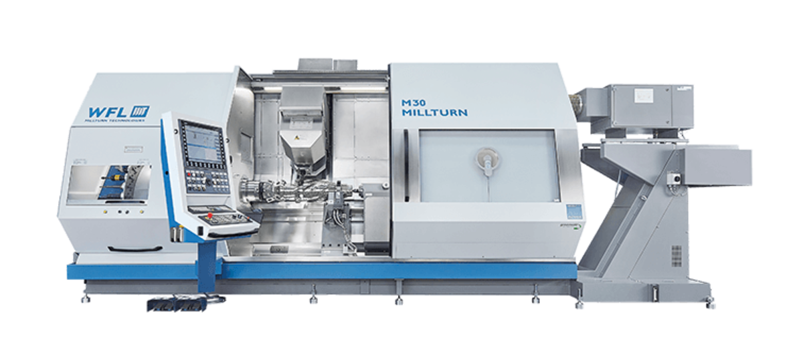
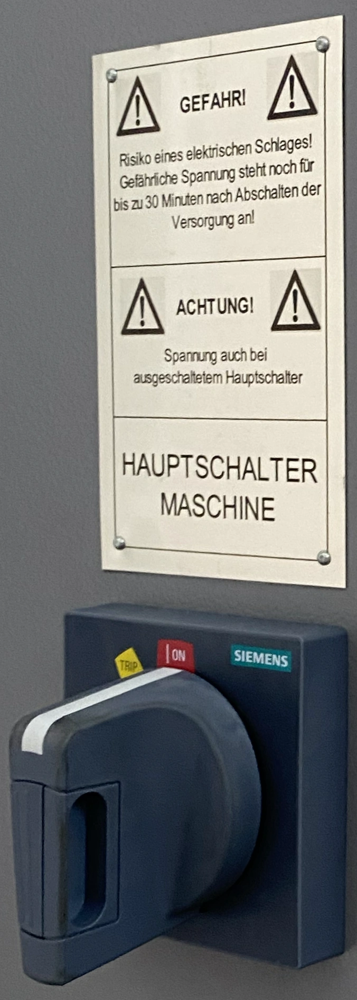
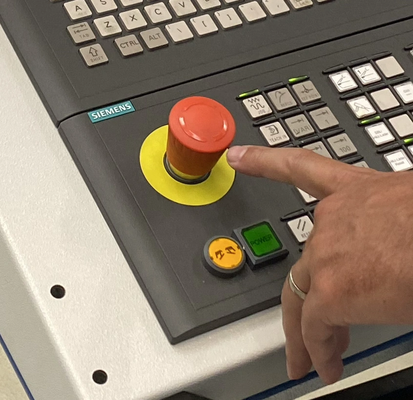
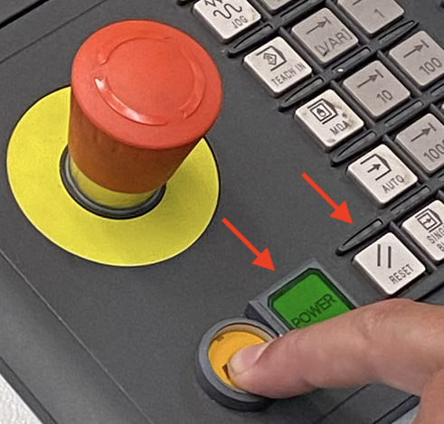
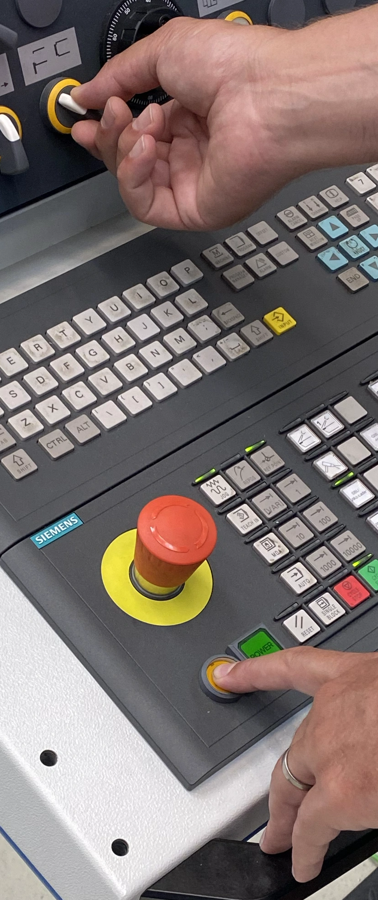
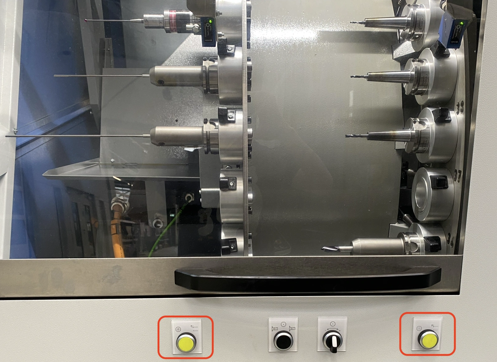
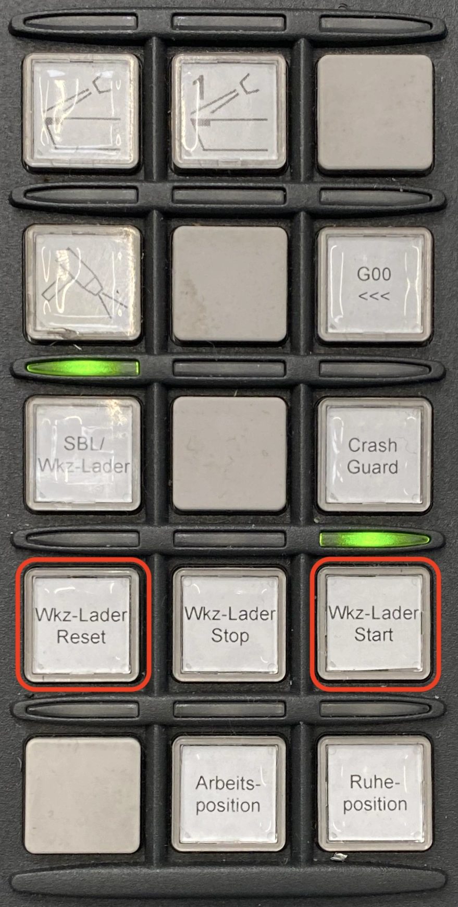

# Einführung WFL M35

Die folgenden Schritte zeigen die grundsätzliche Bedienung der CNC-Maschine WFL M35 im [TEC-Lab](http://www.ift.at/das-institut/standorte/):

> **Anmerkung**: Alle Angaben ohne Gewähr!

## Einrichten der Maschine

1. Hauptschalter einschalten

   Der Schalter befindet sich auf der Rückseite der Maschine:

   

2. Warten bis die Maschine hochfährt

   Dieser Vorgang dauert üblicherweise ein paar Minuten. Im Bedien-Terminal sollte keine Fortschrittsanzeige mehr zu sehen sein.

3. Darauf achten, dass der „Notaus“-Schalter deaktiviert ist

   

   Der Schalter sollte „heraus-gedreht“/„gezogen“ werden, falls das nicht der Fall ist.

4. Bei der Initialisierung kann es nicht schaden

   - den grünen <kbd>Power</kbd>-Button
   - und danach <kbd>Reset</kbd> zu drücken.

   Diese Schalter befinden sich rechts unter dem „Notaus“:

   

5. Die Haupt-Türe muss am Anfang geöffnet und geschlossen werden

   Dazu muss man die „Zweihand-Taster“ betätigen und dann den Schiebeschalter für die Tür:

   

   1. nach links bewegen um die Tür zu öffnen und dann
   2. nach rechts bewegen um die Tür zu schließen.

6. Die Türe vom Werkzeuglader muss händisch geschlossen und geöffnet werden:

   

   Danach sollten die beiden gelben Schalter unter dem Werkzeuglader **nicht** mehr leuchten.

7. Um den Werkzeuglader zu initialisieren sollte als erstes der Button

   <kbd>Wkz-Lader Reset</kbd> und dann <kbd>Wkz-Lader Start</kbd> drücken:

   
