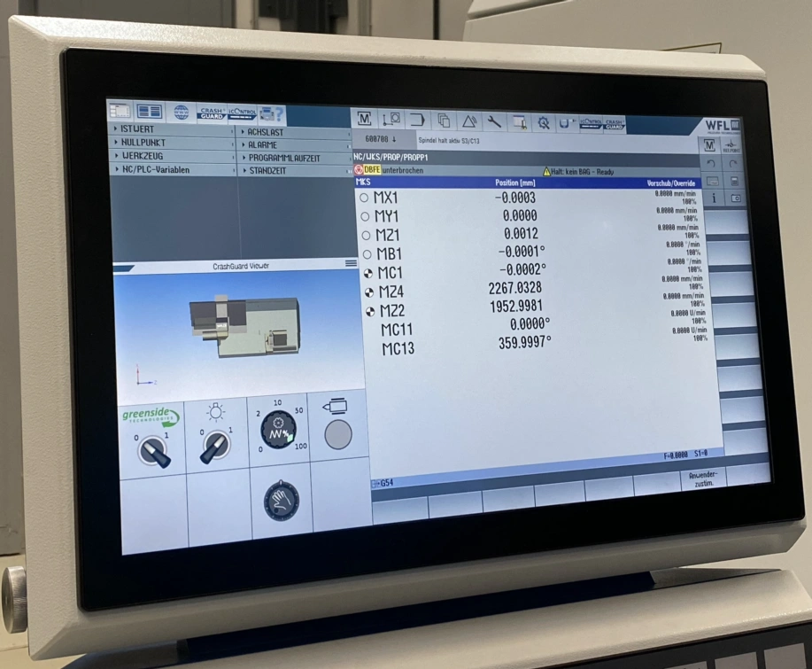
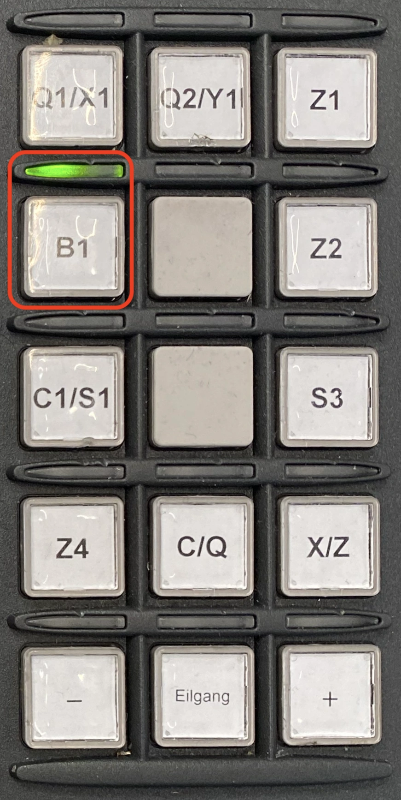
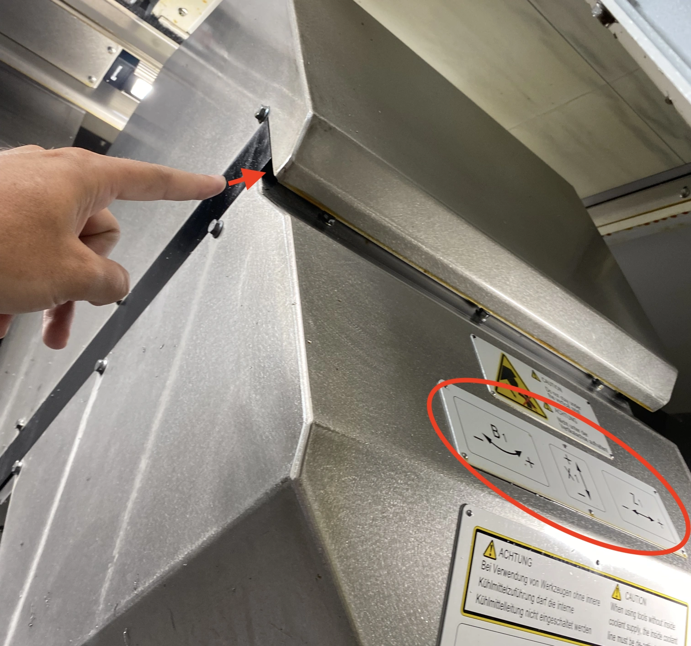
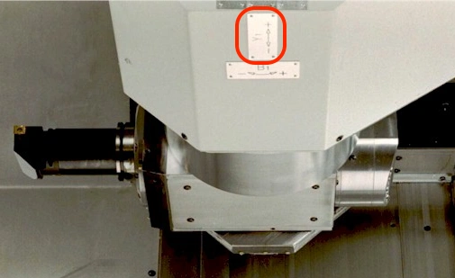
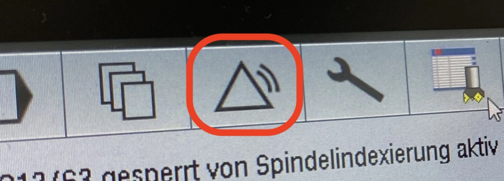
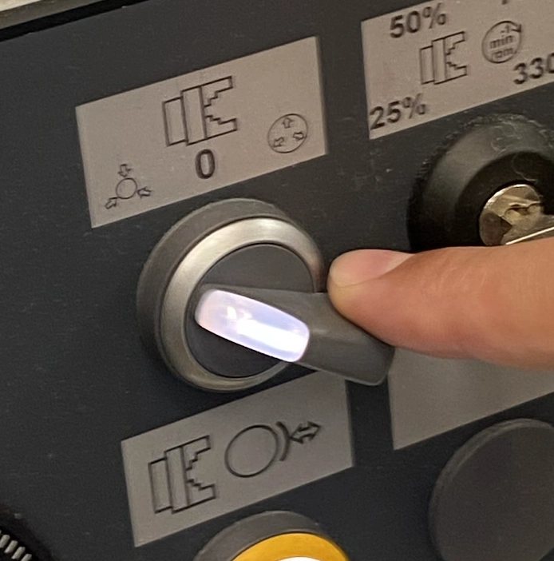
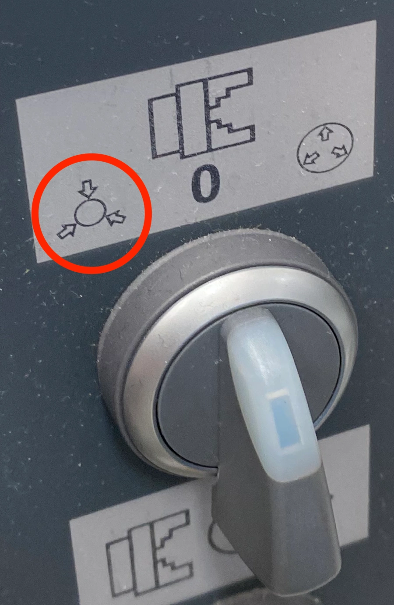

# Einführung WFL M35

Die folgenden Schritte zeigen die grundsätzliche Bedienung der CNC-Maschine WFL M35 im [TEC-Lab](http://www.ift.at/das-institut/standorte/):

> **Anmerkung**: Alle Angaben ohne Gewähr!

## Einrichten der Maschine

### Einschalten

Der Hauptschalter befindet sich auf der Rückseite der Maschine:

   

### Startup Abwarten

Warten bis die Maschine hochfährt

Dieser Vorgang dauert üblicherweise ein paar Minuten. Im Bedien-Terminal sollte keine Fortschrittsanzeige mehr zu sehen sein.

### Notaus Deaktivieren

Darauf achten, dass der „Notaus“-Schalter deaktiviert ist

Der Schalter sollte „heraus-gedreht“/„gezogen“ werden, falls das nicht der Fall ist.

### Reset/Power

Bei der Initialisierung kann es nicht schaden

- den grünen <kbd>Power</kbd>-Button
- und danach <kbd>Reset</kbd> zu drücken.

Diese Schalter befinden sich rechts unter dem „Notaus“:

   

### Haupttüre Initialisieren

Die Haupt-Türe muss am Anfang geöffnet und geschlossen werden

Dazu muss man die „Zweihand-Taster“ betätigen und dann den Schiebeschalter für die Tür:

   

1.  nach links bewegen um die Tür zu öffnen und dann
2.  nach rechts bewegen um die Tür zu schließen.

### Werkzeuglader-Türe Initialisieren

Die Türe vom Werkzeuglader muss händisch geschlossen und geöffnet werden. Danach sollten die beiden gelben Schalter unter dem Werkzeuglader **nicht** mehr leuchten.

### Werkzeuglader Initialisieren

Um den Werkzeuglader zu initialisieren sollte als erstes der Button

<kbd>Wkz-Lader Reset</kbd> und dann <kbd>Wkz-Lader Start</kbd> drücken:

### Referenzpunkte setzen

Zum Setzen der Referenzpunkte muss man die jeweilige Achse für den Punkt aktivieren und dann mittels Betätigung des Buttons <kbd>+</kbd> oder <kbd>-</kbd> zum nächsten Referenzpunkt fahren. In der unteren Beispiel-Grafik ist die Achse B1 aktiviert:

Bei den doppelt belegten Tasten z.B. <kbd>Q1/X1</kbd> oder <kbd>Q2/Y1</kbd> sollte darauf geachtet werden, dass die Taste <kbd>C/Q</kbd> **nicht aktiviert ist** (Licht ausgeschalten). Ansonsten wird bei den erwähnten Beispiel-Tasten `Q1` beziehungsweise `Q2` aktiviert obwohl man eigentlich die Achse `X1` beziehungsweise `X2` auswählen wollte.

**Beim Drücken der Tasten <kbd>+</kbd> oder <kbd>-</kbd> sollte beachtet werden, dass der Weg in die jeweilige Richtung frei ist!** Im Zweifelsfall sollte jeweils die Richtung, mittels <kbd>+</kbd>/<kbd>-</kbd> gewählt werden, bei dem mehr Platz zum Fahren frei ist. Die Orientierung der Achsen ist dabei auf dem Schlitten zu sehen:

Im obigen Bild ist die Fahrt in Richtung Y1 praktisch nur mittels <kbd>-</kbd> möglich ist da der Schlitten ansonsten in den Gummipuffer fährt.

Die Referenzpunkte kann man beispielsweise in der Reihenfolge anfahren die am am Display angezeigt wird:

1. Referenzpunkt für Achse **X1** anfahren:

   1. Button <kbd>Q1/X1</kbd> drücken
   2. Button <kbd>C/Q</kbd> sollte nicht aktiviert sein
   3. <kbd>+</kbd> oder <kbd>-</kbd> drücken, je nachdem in welche Richtung mehr Platz frei ist

2. Referenzpunkt für Achse **Y1** anfahren (hier ist ein Anfahren mittels **<kbd>+</kbd> meist nicht möglich**):

   1. Button <kbd>Q2/Y1</kbd> drücken
   2. Button <kbd>C/Q</kbd> sollte nicht aktiviert sein
   3. <kbd>+</kbd> oder **<kbd>-</kbd>** drücken, je nachdem in welche Richtung mehr Platz frei ist

3. Referenzpunkt für Achse **Z1** anfahren

   1. Button <kbd>Z1</kbd> drücken
   2. <kbd>+</kbd> oder <kbd>-</kbd> drücken, je nachdem in welche Richtung mehr Platz frei ist

4. Referenzpunkt für Achse **B1** anfahren

   1. Button <kbd>B1</kbd> drücken
   2. Button <kbd>+</kbd> oder <kbd>-</kbd> drücken; Auch beim Drücken der Taste <kbd>+</kbd> sollte sich hier der Kopf in die Richtung <kbd>-</kbd> bewegen

### Überprüfen der Initialisierung

- Bei der Bedientafel sollten keine Leuchten blinken
- Die beiden gelben Leuchten unter der Werkzeuglader-Türe sollten nicht leuchten
- Die Alarmliste sollte keine Meldungen enthalten:

  

## Problembehandlung

### Spannfutter-Modus-Schalter Blinkt

Auch wenn man kein Werkstück einspannen will (Schalterstellung 0) muss der Alarm trotzdem deaktiviert werden. Dazu kann man folgende Schritte verwenden:

1. [Haupt-Türe öffnen](#readme:section:hauptuere-initialisieren)
2. Spannfutter-Modus-Schalter auf „Außen-Spannen“ stellen:

   

3. Fußschalter mit Spannfuttersymbol benützen um die Werkstückaufnahme ganz zu öffnen

   

   Hierbei ist zu beachten, dass die zwei Schalter links und rechts eine **Doppelfunktion** besitzen. Während ein leichtes Drücken die Werkstückaufnahme öffnet oder schließt, sorgt ein fester Druck dafür, dass der „Notaus“ aktiviert wird. Sollte versehentlich der Notaus aktiviert worden sein, kann man diesen mittels der dunkelgrünen Schalter am vorderen Ende des Fußschalters deaktivieren:

   

4. Spannfutter-Modus-Schalter auf „0“ stellen
