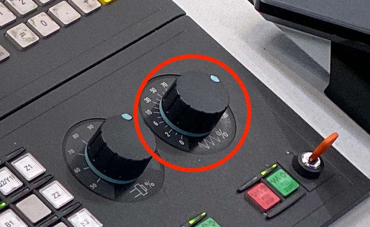

# Einführung WFL M35

Die folgenden Beschreibung zeigt oberflächlich die grundsätzliche Bedienung der CNC-Maschine WFL M35 im [TEC-Lab](http://www.ift.at/das-institut/standorte/).

[](https://www.wfl.at/en/machines/millturn/m30-m30-g-m35-m35-g)

> **Anmerkung**: Alle Angaben ohne Gewähr!

## Einrichten der Maschine

### Einschalten

Der Hauptschalter befindet sich auf der Rückseite der Maschine:

{width=30%}

### Startup Abwarten

Warten bis die Maschine hochfährt

Dieser Vorgang dauert üblicherweise ein paar Minuten. Im Bedien-Terminal sollte keine Fortschrittsanzeige mehr zu sehen sein.

### Notaus Deaktivieren

Darauf achten, dass der „Notaus“-Schalter deaktiviert ist

{width=30%}

Der Schalter sollte „heraus-gedreht“/„gezogen“ werden, falls das nicht der Fall ist.

### Reset/Power

Bei der Initialisierung kann es nicht schaden

- den grünen <kbd>Power</kbd>-Button
- und danach <kbd>Reset</kbd> zu drücken.

Diese Schalter befinden sich rechts unter dem „Notaus“:

{width=30%}

### Haupttüre Initialisieren {#hauptuere-initialisieren}

Die Haupt-Türe muss am Anfang geöffnet und geschlossen werden

Dazu muss man den „Zweihand-Taster“ betätigen und dann den Schiebeschalter für die Tür:

{width=30%}

1.  nach links bewegen um die Tür zu öffnen und dann
2.  nach rechts bewegen um die Tür zu schließen.

### Werkzeuglader-Türe Initialisieren

Die Türe vom Werkzeuglader muss händisch geschlossen und geöffnet werden. Danach sollten die beiden gelben Schalter unter dem Werkzeuglader **nicht** mehr leuchten.

{width=50%}

### Werkzeuglader Initialisieren

Um den Werkzeuglader zu initialisieren sollte als erstes der Button <kbd>Wkz-Lader Reset</kbd> und dann <kbd>Wkz-Lader Start</kbd> gedrückt werden:

{width=20%}

### Referenzpunkte setzen

{width=50%}

Zum Setzen der Referenzpunkte muss man die jeweilige Achse für den Punkt aktivieren und dann mittels Betätigung des Buttons <kbd>+</kbd> oder <kbd>-</kbd> zum nächsten Referenzpunkt fahren. In der unteren Beispiel-Grafik ist die Achse B1 aktiviert:

{width=20%}

Bei den doppelt belegten Tasten z.B. <kbd>Q1/X1</kbd> oder <kbd>Q2/Y1</kbd> sollte darauf geachtet werden, dass die Taste <kbd>C/Q</kbd> **nicht aktiviert ist** (Licht ausgeschalten). Ansonsten wird bei den erwähnten Beispiel-Tasten `Q1` beziehungsweise `Q2` aktiviert obwohl man eigentlich die Achse `X1` beziehungsweise `X2` auswählen wollte.

**Beim Drücken der Tasten <kbd>+</kbd> oder <kbd>-</kbd> sollte beachtet werden, dass der Weg in die jeweilige Richtung frei ist!** Im Zweifelsfall sollte jeweils die Richtung, mittels <kbd>+</kbd>/<kbd>-</kbd> gewählt werden, bei dem mehr Platz zum Fahren frei ist. Die Orientierung der Achsen ist dabei auf dem Schlitten zu sehen:

{width=40%}

Im obigen Bild ist die Fahrt in Richtung Y1 praktisch nur mittels <kbd>-</kbd> möglich, da der Schlitten ansonsten in den Gummipuffer fährt.

{width=40%}

Die Referenzpunkte kann man beispielsweise in der Reihenfolge anfahren die am am Display angezeigt wird:

1. Referenzpunkt für Achse **X1** (Oben/Unten) anfahren:

   1. Button <kbd>Q1/X1</kbd> drücken
   2. Button <kbd>C/Q</kbd> sollte nicht aktiviert sein
   3. <kbd>+</kbd> oder <kbd>-</kbd> drücken, je nachdem in welche Richtung mehr Platz frei ist

2. Referenzpunkt für Achse **Y1** (Schräg „oben vorne“/„unten hinten“) anfahren (hier ist ein Anfahren mittels **<kbd>+</kbd> meist nicht möglich**):

   1. Button <kbd>Q2/Y1</kbd> drücken
   2. Button <kbd>C/Q</kbd> sollte nicht aktiviert sein
   3. <kbd>+</kbd> oder **<kbd>-</kbd>** drücken, je nachdem in welche Richtung mehr Platz frei ist

3. Referenzpunkt für Achse **Z1** (links/rechts) anfahren

   1. Button <kbd>Z1</kbd> drücken
   2. <kbd>+</kbd> oder <kbd>-</kbd> drücken, je nachdem in welche Richtung mehr Platz frei ist

4. Referenzpunkt für Achse **B1** (Schwenk links/rechts) anfahren

   1. Button <kbd>B1</kbd> drücken
   2. Button <kbd>+</kbd> oder <kbd>-</kbd> drücken; Auch beim Drücken der Taste <kbd>+</kbd> sollte sich hier der Kopf in die Richtung <kbd>-</kbd> bewegen

### Überprüfen der Initialisierung

- Bei der Bedientafel sollten keine Leuchten blinken
- Die beiden gelben Leuchten unter der Werkzeuglader-Türe sollten nicht leuchten
- Die Alarmliste sollte keine Meldungen enthalten:

  {width=30%}

## Problembehandlung

### Spannfutter-Modus-Schalter Blinkt

{width=20%}

Auch wenn man kein Werkstück einspannen will (Schalterstellung 0) muss der Alarm trotzdem deaktiviert werden. Dazu kann man folgende Schritte der Reihe nach abarbeiten:

1. [Haupt-Türe öffnen](#hauptuere-initialisieren)
2. Spannfutter-Modus-Schalter auf „Außen-Spannen“ stellen:

   {width=20%}

3. Fußschalter mit Spannfuttersymbol benützen um die Werkstückaufnahme ganz zu öffnen

   {width=30%}

   Hierbei ist zu beachten, dass die zwei Schalter links und rechts eine **Doppelfunktion** besitzen. Während ein leichtes Drücken die Werkstückaufnahme öffnet oder schließt, sorgt ein fester Druck dafür, dass der „Notaus“ aktiviert wird. Sollte versehentlich der Notaus aktiviert worden sein, kann man diesen mittels der dunkelgrünen Schalter am vorderen Ende des Fußschalters deaktivieren:

   {width=30%}

4. Spannfutter-Modus-Schalter auf „0“ stellen

## Werkzeug Aufrüsten

Um ein Werkzeug (wie z.B. eine STH) „aufzurüsten“ (ins Magazin zu geben) kann man folgende Schritte verwenden:

1. Einen leeren Platz im Magazin suchen; Die Werkzeug-Nummer ist am Rand des Trommel-Magazins zu sehen

   {width=40%}

2. Um das Magazin zu drehen kann man den unten gezeigten Schalter verwenden:

   {width=40%}

3. In der Magazinliste:

   {width=30%}

   {width=30%}

   auf den freien Eintrag für die Werkzeugnummer klicken:

   {width=40%}

   und den Button <kbd>Aufrüsten</kbd> drücken um ein neues Werkzeug einzurichten oder um Eines aus dem Archiv zu importieren.

4. Bei den Daten vom Werkzeug kann z.B. folgende Auswahl getroffen werden (solange man das Werkzeug nicht für einen Eingriff verwendet):

   - **Duplonummer** muss immer 1 sein
   - **Schnittstelle:** Normal
   - **Name:** Beliebig (ein markanter Name hilft später beim Holen der Daten aus Archiv)
   - **Längenkategorie:** 250 mm (hier darauf achten, dass das Tool nicht länger als 250 mm ist, besonders wenn man es in die rechte Trommel mit geringerer Breite gibt)
   - **Durchmesserkategorie:** klein
   - **Werkzeugtyp:** Bohr oder Fräßwerkzeug
   - **Durchmesser** und **Länge** des Werkzeuges (ungefähr) eingeben

   Die Eingabe sollte man dann mittels des <kbd>Input</kbd>-Buttons bestätigen

   {width=40%}

   Danach noch **Ohne Geometrie** (kein Crash-Schutz!) auswählen

5. Auf „Aufrüsten“ klicken; Das Werkzeugmagazin sollte jetzt automatisch auf die korrekte Stelle für die gewählte Werkzeugnummer fahren
6. Magazintür öffnen
7. Werkzeug einspannen

   Zum Entfernen beziehungsweise Spannen des Stifts der das Werkzeug festhält bitte folgenden Button drücken:

   {width=50%}

   Beim Einspannen ist darauf zu achten, dass absolut **kein Spalt** entsteht.

   {width=40%}

   {width=40%}

8. Die Magazintür schließen

## Programm Laden

1. Auf das Programm-Icon klicken:

   {width=20%}

2. [Programm](Source/SMART_TOOL_TEST1.MPF) wählen:

   ```mpf
   MCHOME       ; Zu Homepoint fahren

   FOR GD[1]=1 to 1              ; Einfache Loop (1 am Ende ersetzen fuer mehrere Durchgaenge)
   TLCH1("Rene_Test_1",0,,1,,,,) ; Werkzeug Rene_Test_1 einwechseln
   M0                            ; Pause
   TLCH1("D4_EG",0,,1,,,,)       ; Werkzeug D4_EG einwechseln
   M0
   ENDFOR

   TLCH1          ; Werkzeug auswechseln
   TLPREP1        ; Werkzeug zurueck ins Magazin
   MCHOME
   M30
   ```

3. Sicherheitshalber die erste Zeile des Programms markieren, damit Programmausführung nicht mitten im Programmcode startet
4. Den Button <kbd>G00</kbd> aktivieren:

   {width=30%}

   damit sich die Ausführung des Programms verlangsamt.

5. Darauf achten, dass der Vorschub (auf einem geringem Level) aktiviert ist:

   {width=40%}

   Der Drehschalter sollte bei der Programmausführung immer im Auge behalten werden, damit die aktuelle Programmausführung – mittels Vorschub 0 – schnell abgebrochen werden kann.

6. Den Button <kbd>CYCLE START</kbd> drücken:

   {width=30%}

   um die Programmausführung zu beginnen

## Zusätzliche Information

Die Maschine wird von [Gerhard Wiesinger](https://tiss.tuwien.ac.at/person/43398.html) betreut. Um sich zu informieren ob die Maschine für eine bestimmten Zeitraum zur Verfügung steht kann man sich bei ihm (bevorzugt per Telefon) melden.
